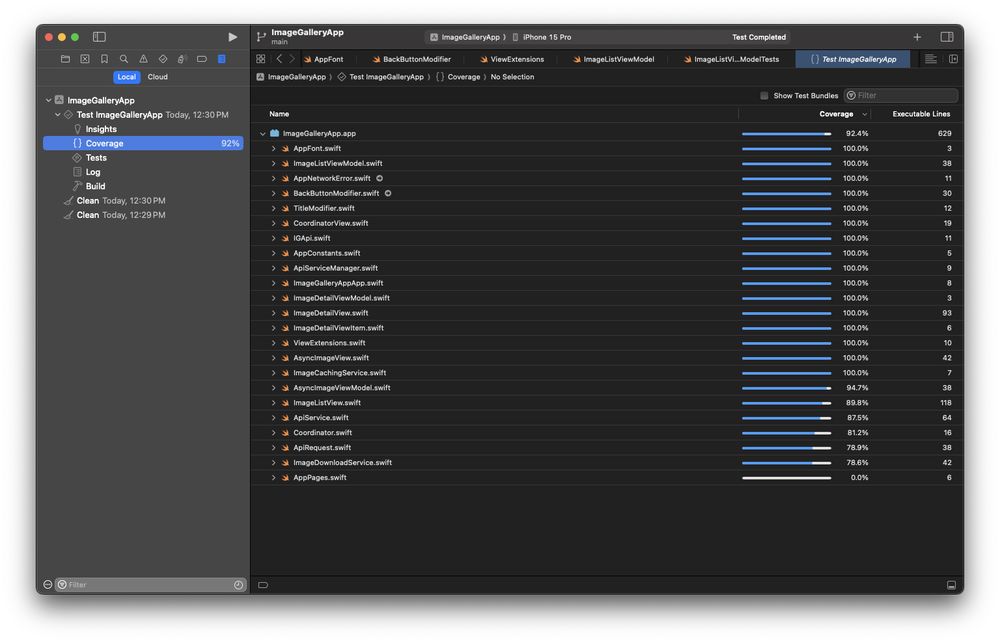

  

# ImageGalleryApp

## Overview
The Image Gallery App is an iOS application that allows users to browse and view images in a grid layout. The app fetches image data from a free image service and displays them efficiently. The app includes an in-house image caching solution to enhance user experience by reducing network usage for duplicate images and providing smoother image loading.

## Features
- Display images in a responsive grid layout.
- In-house image caching to minimize network usage and improve performance.
- Smooth scrolling experience even when dealing with large sets of images.
- Uses modern iOS development practices, including SwiftUI, Combine, and async/await.

## Key Features
- **Architectural Patterns**: MVVM, Dependency Injection (DI), Coordinator Pattern.
- **Technology Stack**: SwiftUI + Combine.
- **Unit Testing**: Comprehensive unit test cases with 92% code coverage.
- **Scalability**: Designed with scalability in mind for future enhancements.
- **Modular Code**: Clear separation of concerns for easy maintenance and feature addition.
- **SOLID Principles**: Codebase adheres to SOLID principles, promoting clean and maintainable code.

## Image Data API
The app fetches image data from the Free Image Service, which provides image metadata including URLs, titles, and IDs.
API: https://jsonplaceholder.typicode.com/photos

## App Demo
| App Demo                                |
| -------------------------------------- |
|  |

[Full App Demo](Screenshots/AppDemo.mp4)

## Code Coverage Screenshot

| Code Coverage                                |
| -------------------------------------- |
|  |

## Requirements
- iOS 14.0 or later.
- Xcode 13.0 or later.
